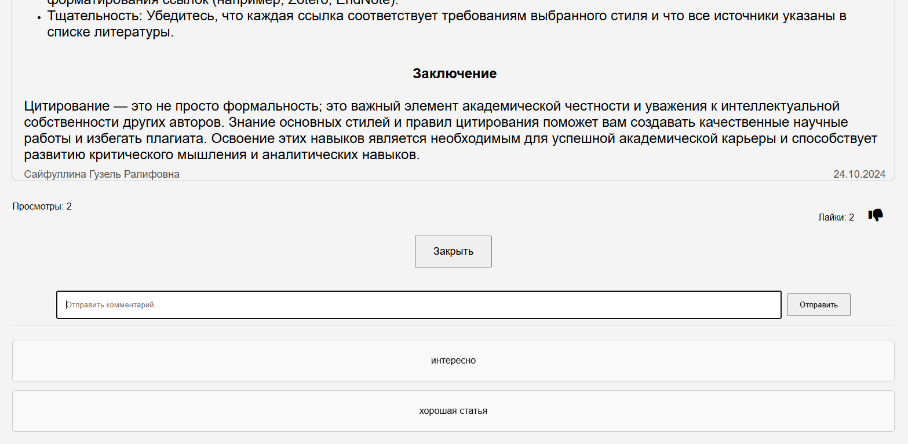
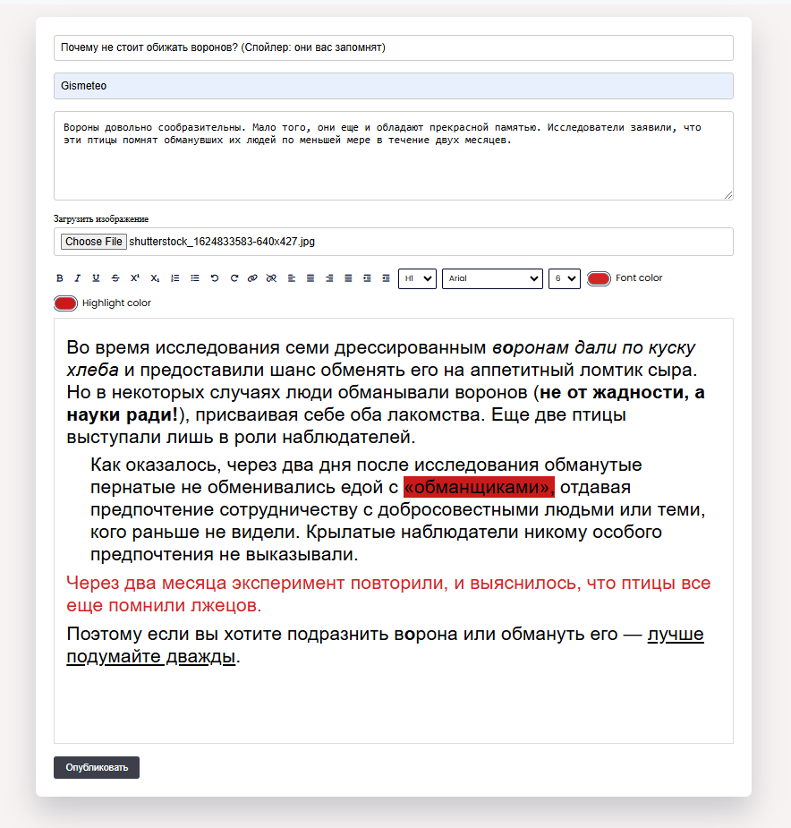

  Сайт для публикации новостей и статей

Главная страница показывает список новостей: титул статьи/новости, титульную картину и описание. Вся информация взята из базы данных.

Так как можно добавлять безграничное количество страниц существует функция нумерации страниц.

При нажатии на какую-либо статью открывается страница этой статьи. Информация этой также берктся из базы данных.

Под статьей имеется функции likes и dislikes, а также комментарии и просмотров. При каждом вводе комментарии данные сохранятся в базе данных и отображаются на страниц при раскрытия модуля "Комментарии". Просмотры считываются при каждой новой сессии.
Количество просмотров не будет увеличисатся даже если страницу обновять. Это возможно только при окончании данной сессии и начатия новой. При нажатии лайка количество лайков увеличивается и если нажать кнопку лайка снова то количество уменшится. Лайки считываются при каждой новой сессии. Если лайк нажат в этой сессии то количество его не увиличится снова пока данная сессия не завершена.

При нажатии на кнопку "Создать статью" открывается статья публикации статьи. На этой странице после ввода титула, описания, автора или источника статьи, можно выбрать картину для представления статьи. В поле ввода текста статьи можно редактировать статью как угодно.
Например, можно изменить цвет шрифта, сделать текст жирным, кривым и т.д.
После нажатия кнопки опубликовать статья будет сохранена в базе данных.

