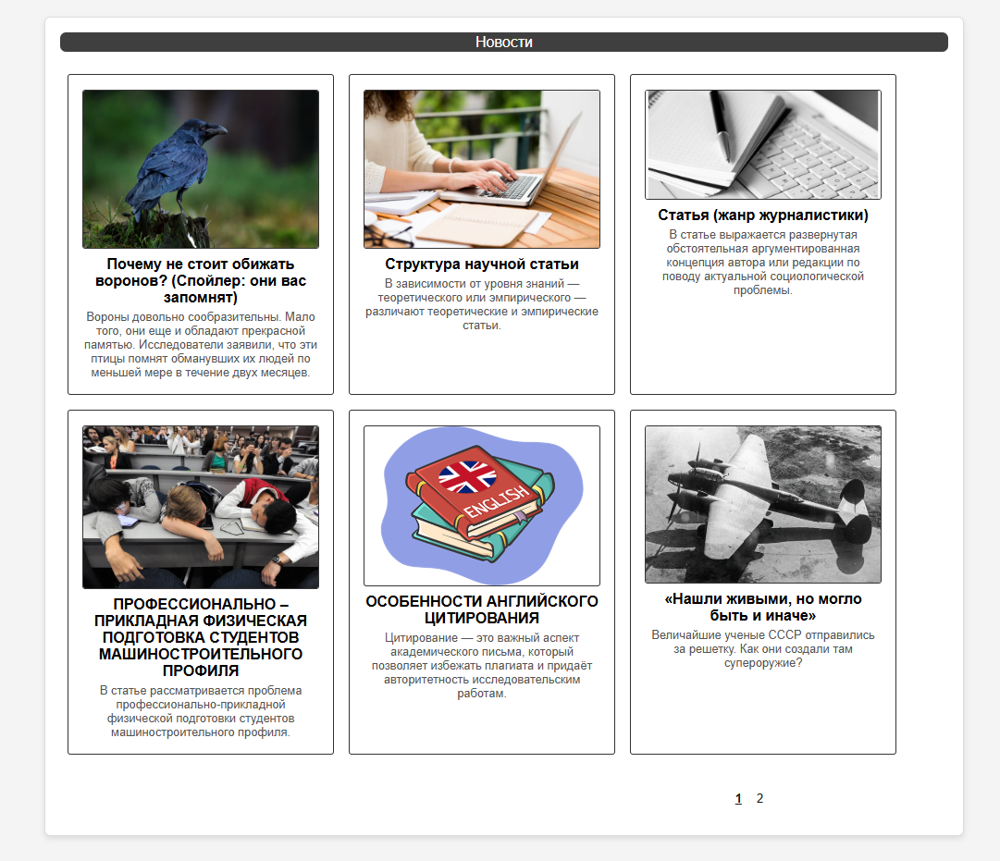
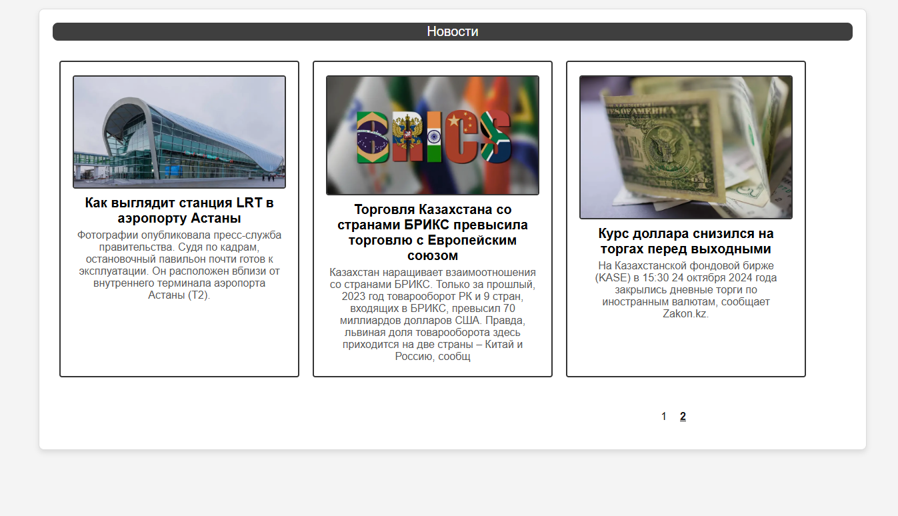
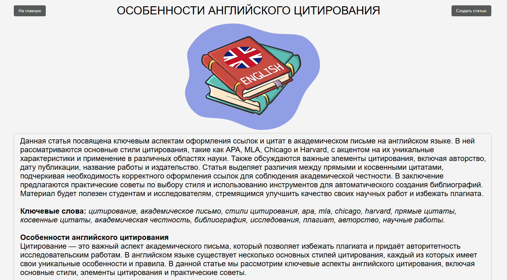

  Сайт для публикации новостей и статей

Главная страница показывает список новостей: титул статьи/новости, титульную картину и описание. Вся информация взята из базы данных.

Так как можно добавлять безграничное количество страниц существует функция нумерации страниц.

При нажатии на какую-либо статью открывается страница этой статьи. Информация этой также берктся из базы данных.

Под статьей имеется функции likes и dislikes, а также комментарии и просмотров. При каждом вводе комментарии данные сохранятся в базе данных и отображаются на страниц при раскрытия модуля "Комментарии". Просмотры считываются при каждой новой сессии.
Количество просмотров не будет увеличисатся даже если страницу обновять. Это возможно только при окончании данной сессии и начатия новой. При нажатии лайка количество лайков увеличивается и если нажать кнопку лайка снова то количество уменшится. Лайки считываются при каждой новой сессии. Если лайк нажат в этой сессии то количество его не увиличится снова пока данная сессия не завершена.

